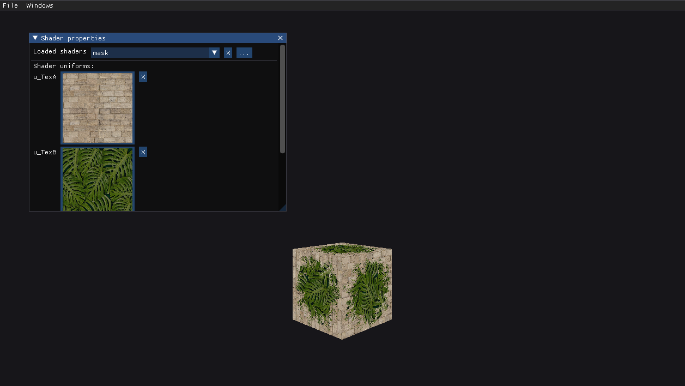
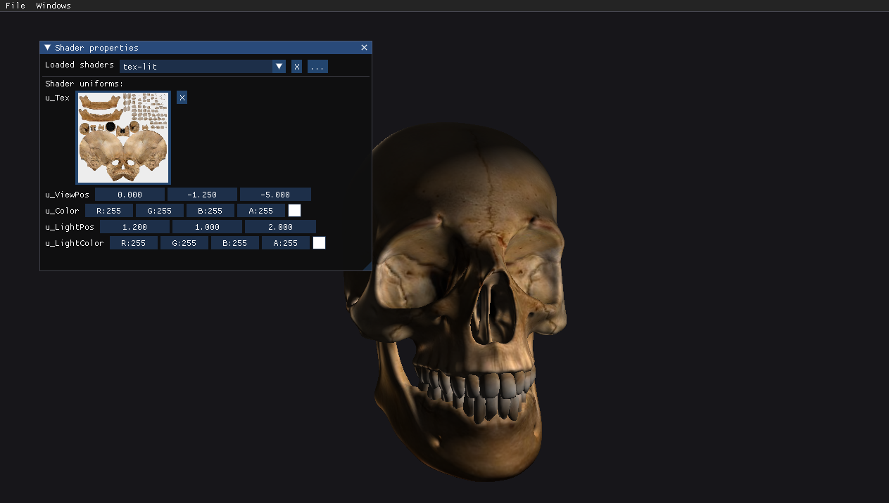
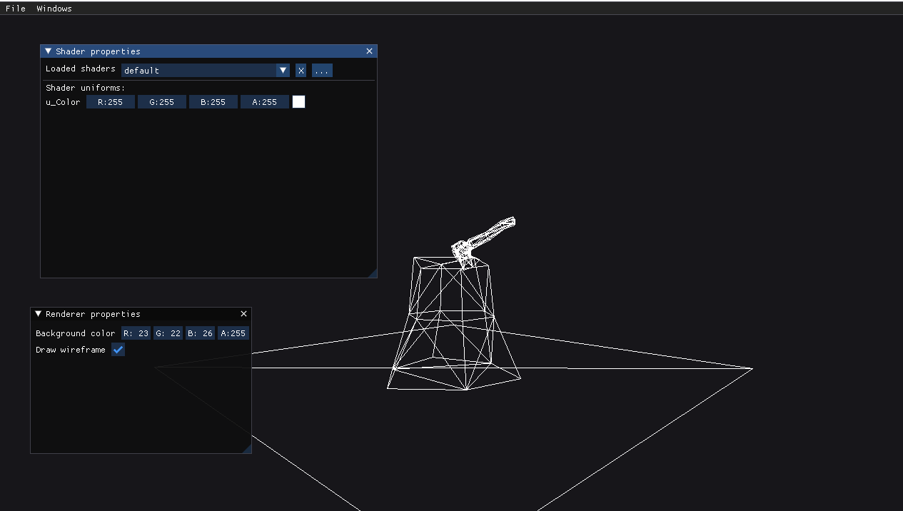

# OpenGL Model Viewer
A model viewer written as a companion app for my IT class presentation at school.

Load up a .obj model into a window and look at it in its glory using the power of OpenGL.

## Building
CMake 3.15+ and a compiler with C++17 support required.
Supported platforms: **Windows**, **Linux**
(tested on Windows 10 and Pop_OS! 5.15.5)

1) Clone this repo by using the     following command:
```bash
git clone --recursive https://github.com/novacti3/opengl-model-viewer "ModelViewer"
```
2) Run `build.bat` (Windows) or `build.sh` (Linux) **as administrator** to build the project
3) Run the executable available in the appropriate config folder (Debug/Release) in the `bin/` directory

## Features
- OBJ model loading (no index buffer)
- Multiple textures
- Custom shader loading
- Shader GUI
    - Editable shader uniforms
    - Texture previews
- Phong lighting shader

## Usage
1) Load an OBJ model by clicking `File->Open file...` in the top left corner of the window and selecting a model file
2) Change the shader by clicking `Windows->Shader properties` and clicking the `...` button next to the dropdown.
NOTE: To load a shader, you must provide a .vs (vertex shader) and .fs (fragment shader) files of the **same name**. Providing only one file or providing two files of different names will result in the shader not being usable.
3) Select the newly loaded shader in the dropdown

Voila! You're able to edit the shader's uniforms, load textures etc.

## Images


